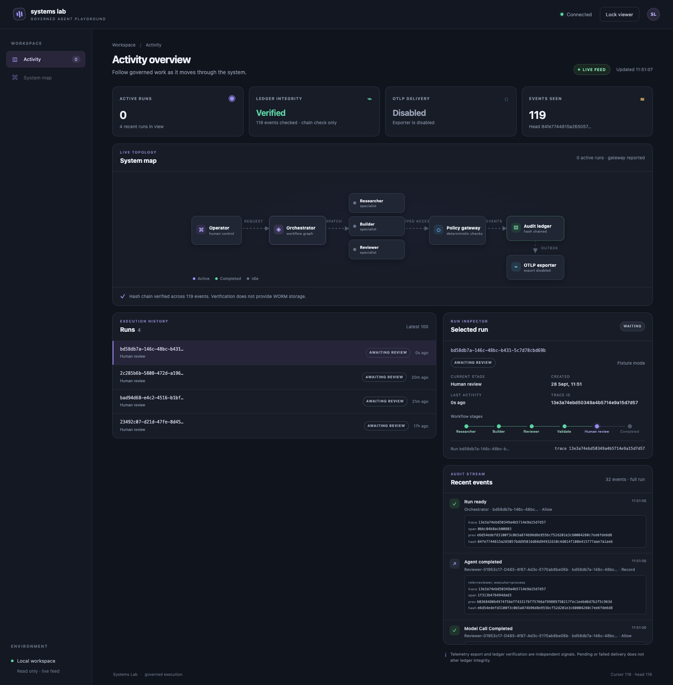
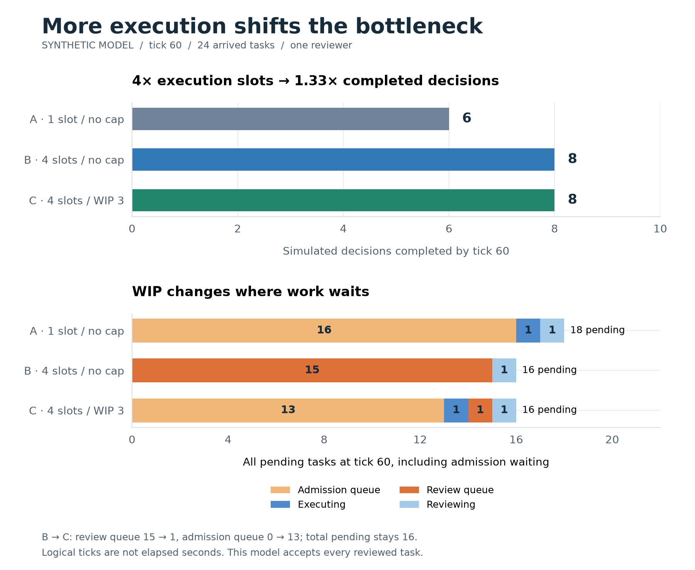

# Agent Systems Lab

A reference playground for building agent-based solutions, comparing tooling,
and exploring systems thinking, including ideas from Donella Meadows's *Thinking in Systems*.

Read [when human review becomes the bottleneck](https://www.saski.com/notes/agent-systems-lab/)
for the review-capacity experiment, its reproducible results and their limits.
More writing lives in [Notes on saski.com](https://www.saski.com/notes/).

The first experiment follows a backlog through **Researcher → Builder → Reviewer
→ human decision**. LangGraph coordinates the workflow; each specialist uses a
real LangChain agent loop. A separate deterministic gateway authorizes every
model and tool call.

**Version 0.1 uses scripted model responses.** It makes no provider requests and
costs no model tokens. The simulation and permission checks are executable;
the agents' reasoning is a fixture. Live model routing is a later experiment.

## Try the local experiment

Requirements: [uv](https://docs.astral.sh/uv/), Python 3.11+, and Make.
Run these commands from the repository root:

```sh
make setup
make demo
```

The demo starts a temporary gateway on localhost, runs three separate Python
processes, saves checkpoints and artifacts under ignored `.lab/`, and pauses
for review. This local process mode is **not an OS sandbox**. Use the container
mode when testing filesystem and network boundaries.

The output gives you a run ID, artifact directory, digest, and the next command.
Inspect the JSON artifacts before recording your decision:

```sh
uv run systems-lab status RUN_ID
uv run systems-lab decide RUN_ID --digest DIGEST --approve
# Or: replace --approve with --reject
```

Acceptance resumes the checkpointed workflow and records your decision. It does
not publish, merge, deploy, or modify external services.

## Follow activity live

```sh
make dashboard
# In another terminal:
make dashboard-demo
```

Open <http://127.0.0.1:8765/dashboard> and connect with `.lab/viewer.token`.
The read-only dashboard shows the component map, agent activity, workflow stages,
run history, audit events, chain integrity and OpenTelemetry delivery state.

[](docs/dashboard.md)

The [illustrated dashboard guide](docs/dashboard.md) explains every module,
indicator and workflow stage, with screenshots of live activity and review.

History is append-only and hash chained, with stable lifecycle event identities.
Export a checkpoint to an independent location to detect privileged history
rewriting against that copy. OpenTelemetry uses a persistent retry outbox and is
enabled only with an explicit OTLP endpoint. See [activity and observability](docs/observability.md)
for commands and the boundaries of these guarantees.

## Try independent containers

Requirements: Docker Engine and Docker Compose v2.24+ (including v5).

```sh
make containers-up
make containers-demo
```

The gateway and Postgres stay running. Each specialist runs in a separate,
temporary container with no external network egress, no host mounts, no Docker
socket, a read-only root filesystem, and resource limits. Model and tool calls
go to the internal gateway. The host CLI owns lifecycle and checkpoints.

Use the same gateway for subsequent decisions and interventions:

```sh
uv run systems-lab --gateway http://127.0.0.1:8765 status RUN_ID
uv run systems-lab --gateway http://127.0.0.1:8765 decide RUN_ID --digest DIGEST --approve
uv run systems-lab --gateway http://127.0.0.1:8765 revoke RUN_ID --stop-containers
make containers-down
```

Stopping Compose retains the database volume. Local and container audit stores
are independent; use the gateway corresponding to the run you created.

## What you can explore

- **Systems theory:** stocks, flows, balancing feedback, delayed observations,
  controller gain, capacity saturation, and unintended behavior.
- **Agent design:** persona and skill boundaries, orchestration versus agent
  loops, specialist contracts, explicit human intervention, and repeatability.
- **Governance:** task identity, least privilege, expiring grants, audit events,
  operation budgets, revocation, and digest-bound approval.

Start with the [backlog feedback experiment](experiments/backlog-feedback/README.md).
It includes a controlled delay comparison, numerical observations, assumptions,
and reading prompts. Use the [experiment guide](experiments/README.md) to add
your own experiments and reading notes.

The [illustrated review-capacity experiment](experiments/review-capacity/README.md)
compares execution slots and WIP limits across two queues. Its numerical model
shows how waiting can move upstream while end-to-end delivery stays the same.
It includes reproducible charts and a standalone interactive learning guide;
integration into the Activity dashboard remains pending.

[](experiments/review-capacity/README.md)

## Extend the playground

- [Illustrated dashboard guide](docs/dashboard.md)
- [Activity, telemetry and history](docs/observability.md)
- [Architecture and trust boundaries](docs/architecture.md)
- [Development and validation](docs/development.md)
- [Evolution roadmap](docs/roadmap.md)
- [Grafana Frontend learning alignment proposal](docs/plans/2026-10-07-grafana-frontend-learning-alignment.md)
- [OpenSpec requirements](docs/openspec/)

The first slice deliberately limits tools to describing, simulating, and
reviewing one system. Arbitrary coding, web research, external writes, live
models, and dynamic child delegation are not enabled. This is a single-user
learning environment, not a production security platform.
