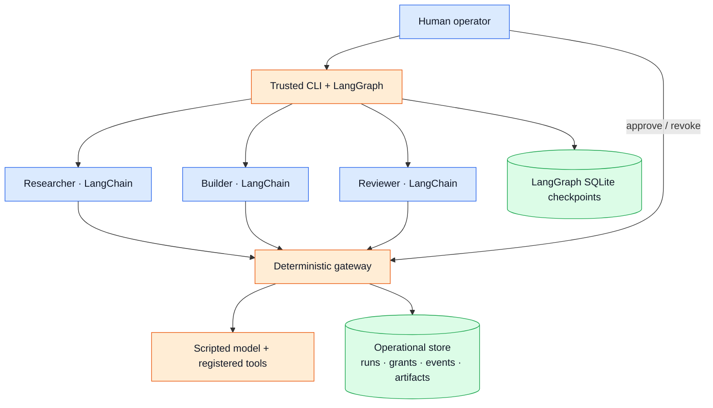

# Architecture

## Three levels of control

1. **LangChain specialists** own the model → tool → model loop, persona, and
   selected procedural skills. The initial model is an explicitly scripted fixture.
2. **LangGraph** owns ordering, state, deterministic validation, checkpoints,
   and the human review interrupt.
3. **The control gateway** owns identity, authorization, expiry, call limits,
   audit records, artifact storage, and run revocation. It does not ask an LLM
   whether an action is permitted.

There is no external message broker in v0. Work is sequential and bounded.
The simulation's task backlog is a modeled stock, not a runtime task queue.

## Physical boundaries

In local mode, the gateway runs briefly on loopback and workers are separate
processes. This mode is for fast development, not filesystem confinement.

In Compose mode, the trusted host CLI creates one-shot worker containers from
one fixed image. The workers network is internal. The database has a different
internal network, reachable by the gateway and not by workers. Only the gateway
API is published, bound to `127.0.0.1:8765`.

The gateway also has an operator-facing bridge so Docker can publish that
loopback port. Workers are not attached to this bridge. The gateway itself is
trusted and can have outbound connectivity; v0 exposes no forwarding tool or
live provider route through it.

The workers share an internal network but expose no listening services and
have no shared writable volumes. This is not hostile multi-tenant isolation.
The host and gateway are trusted. Container escape and compromise of the host,
Docker daemon, gateway, or database are outside this first experiment's guarantee.

There is no worker shell tool. Registered numerical tools execute in the trusted
gateway, with strict scenario validation and a 1,000-step limit. General code
execution needs a separate sandbox design before it can be added.

## Identity and permissions

`agents/<role>/agent.yaml` records a stable role, owner, runtime, model route,
and requested capabilities. The closed `CAPABILITIES` map in `store.py` is the
enforcement authority. Changing a persona or requested capabilities cannot
expand this map.

The operator creates a run and receives separate task grants for each role.
Every grant has a unique instance ID, run ID, role, expiration, and maximum
number of calls. The worker receives an opaque bearer token via stdin; only its
SHA-256 hash is stored. Worker credentials cannot create grants or use operator
endpoints. The gateway resolves identity from the token, never a caller-supplied role.

| Role | Permitted operations |
| --- | --- |
| Researcher | `model.call`, `system.describe` |
| Builder | `model.call`, `simulation.run` |
| Reviewer | `model.call`, `simulation.review` |

All model calls use the gateway's `fixture` route. No real provider credentials
are configured or copied from Codex, Hermes, or other clients.

## State, recovery, and intervention

The operational store is SQLAlchemy-backed SQLite locally and Postgres in
Compose. It records identities, permissions, statuses, fixture provenance,
authorization outcomes, and artifacts. These records are not an immutable or
tamper-proof audit service; the trusted host/database owner can change them.

LangGraph checkpoints use a separate SQLite file on the host. They describe
workflow progress, not authorization. Reopening a checkpoint cannot approve
the run. Operator approval is checked against the authoritative store and the
digest of scenario, artifacts, and policy version.

Artifacts are recorded once per name and run. Retrying a completed registered
tool returns the existing artifact. After validation, the run becomes
`awaiting_review`, which closes worker access. This scoped idempotency does not
claim exactly-once execution for future external side effects.

Revocation changes the authoritative run status. Subsequent calls fail without
waiting for token expiry. `revoke --stop-containers` also kills containers
carrying the exact run label. A call already admitted can still be in flight;
recording its artifact checks run status again. Revocation does not undo past
effects. Local process mode revokes access but does not provide the container
kill guarantee. A worker timeout revokes the run and kills its containers.

## Extension contract

`AgentRuntime.run(role, gateway_url, token) -> AgentResult` isolates the inner
agent implementation from the graph. Keep that contract and permission model
when experimenting with Hermes, ADK, OpenAI Agents SDK, or Claude Agent SDK.

Useful future comparisons change one runtime or control at a time, using the
same task, fixtures, budgets, and outcome criteria. Adding a framework is an
experiment, not automatically an architectural improvement.

## References

- [LangGraph overview](https://docs.langchain.com/oss/python/langgraph/overview)
- [LangGraph interrupts](https://docs.langchain.com/oss/python/langgraph/interrupts)
- [LangChain agents](https://docs.langchain.com/oss/python/langchain/agents)
- [Docker Compose service controls](https://docs.docker.com/reference/compose-file/services/)
- [Blueprint Alliance reference architecture announcement](https://investor.okta.com/news-and-events/news-releases/news-details/2026/Industry-Leaders-Form-the-Blueprint-Alliance-to-Advance-a-Shared-Architecture-for-Securing-AI-Agents/default.aspx)

The design applies selected reference principles. It is not a certified or
complete implementation of Blueprint Alliance governance.

## Observable activity and historical evidence

The gateway commits an append-only journal and a delivery outbox with each
operational event. The dashboard reads journal-derived activity; OpenTelemetry
receives correlated spans from that outbox. Collector outages do not interrupt
authorization or the workflow. Database triggers and hash verification protect
normal append-only use; independent checkpoints detect rewriting against an
older trusted head. This local architecture does not exclude a privileged host
or database administrator. See [observability](observability.md) for details.
