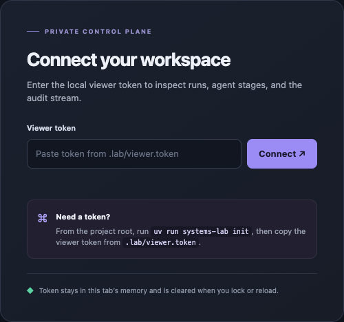
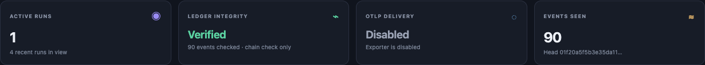
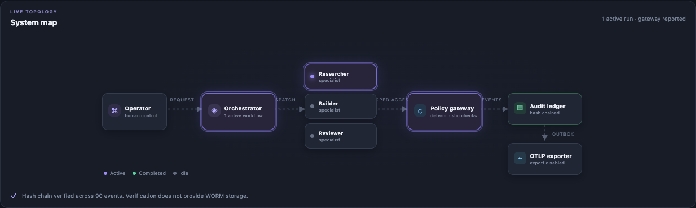
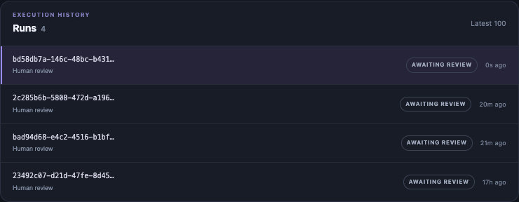
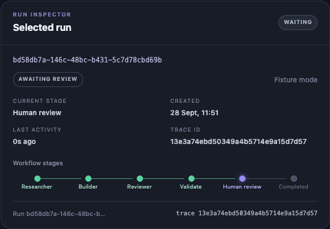
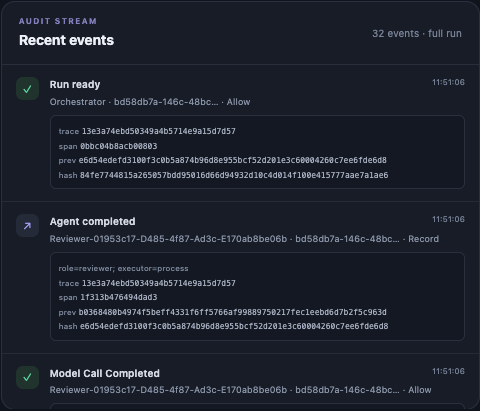
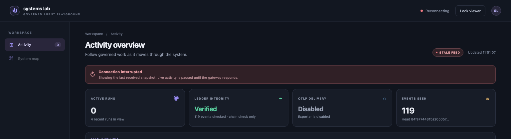
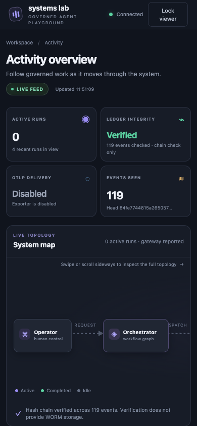

# Activity dashboard

The dashboard is a read-only view of activity recorded by the gateway. It helps
you follow runs, inspect their workflow stages and audit events, and compare
ledger integrity with OpenTelemetry delivery. It does not start workers or make
human review decisions.

The screenshots were captured on **28 September 2026**, using interface revision
`32a65e8`, the local process executor, fixture models, and OTLP export disabled.
They show actual recorded workflow activity. The overview contains four runs
awaiting review; the map and metric close-ups capture the newest run while its
Researcher is active. Still images freeze these states; open the dashboard to
see the animation.

## Start and connect

From the repository root, start the persistent local gateway and dashboard:

```sh
make dashboard
```

In a second terminal, create a real fixture run through that gateway:

```sh
make dashboard-demo
```

Open <http://127.0.0.1:8765/dashboard> and enter the contents of
`.lab/viewer.token` in the Viewer token field. The token is a credential: keep
its value private and do not include it in screenshots or messages. The browser
keeps it in the current tab's memory; **Lock viewer** or a page reload clears it
and requires you to connect again. If the file is missing, initialize the local
workspace with `uv run systems-lab init` from the project root.

The demo uses `model_mode: fixture`: it runs the real workflow and tool loop
with scripted model responses, without calling a model provider. Its activity
demonstrates the system flow, not the quality or safety of live model reasoning.
The local dashboard and demo must use the same persistent gateway so the browser
can observe the run.



*The connection form before entering the viewer credential.*

## Read the overview


*The newest run is selected at Human review; its automated stages have finished.*

The top bar reports the gateway connection, the **Lock viewer** control, and
the most recent successful poll time. The feed badge says **LIVE FEED** while
polling succeeds, **STALE FEED** after a poll fails, and **FEED IDLE** before
connecting. When stale, the dashboard keeps the last received snapshot visible
and pauses live activity animation while it retries.
**Connected** confirms the browser can reach the gateway; it does not confirm
that workers or the telemetry receiver are healthy.

The left rail contains **Activity** and **System map** labels. Activity's count
is the number of runs currently reported as `running`. **System map** names the
topology panel on this page; it is not a separate clickable page.

### Status cards



*The four independent signals while the fixture run is executing.*

The four cards report different signals:

| Card | Meaning |
| --- | --- |
| **Active runs** | Runs whose reported status is `running`, among the latest 100 runs in view. |
| **Ledger integrity** | The gateway's hash-chain verification result: **Verified**, **Mismatch**, or **Unknown**. The note gives the checked event count. Verification checks linkage; it does not provide WORM storage. |
| **OTLP delivery** | Whether the exporter is disabled or enabled, and whether spans are pending or the latest delivery failed. With delivery clear, **Enabled** means no delivery is pending; it does not mean that a downstream system guarantees permanent retention. |
| **Events seen** | The event count reported by ledger verification. The note shows the ledger head hash when available. This is not the number of events currently visible in the timeline. |

The footer's cursor is the dashboard's event polling position; **head** is the
gateway-reported ledger head sequence. A gap between them can mean the dashboard
still has more events to fetch. Ledger integrity and OTLP delivery are
independent: pending or failed telemetry does not change the chain check.

## Follow the system map



*Researcher is active; the remaining specialists have not started.*

The map summarizes the configured architecture, rather than discovering services
automatically. In the current experiment, its components have these roles:

| Component | Role in the displayed flow |
| --- | --- |
| Operator | Starts work and records human decisions through the CLI. |
| Orchestrator | Coordinates the LangGraph workflow and dispatches specialist work. |
| Researcher | Describes the system through `system.describe`. |
| Builder | Runs the backlog experiment through `simulation.run`. |
| Reviewer | Evaluates the simulation through `simulation.review`. |
| Policy gateway | Applies deterministic access checks and records activity. |
| Audit ledger | Stores the ordered, hash-chained event history. |
| OTLP exporter | Sends spans from the ledger outbox to an explicitly configured receiver. |

The map's activity indicators summarize **all qualifying active runs**, not
only the run selected in the inspector. The orchestrator and gateway animate
when at least one recently created or recently active run is running; specialist
nodes show reported running, completed, failed, or timed-out states for those
runs. The ledger indicator reflects the gateway's integrity result, and the
exporter indicator reflects telemetry state. A stale connection pauses live
animation. These are gateway observations, not process health checks. The
legend's **Active**, **Completed**, and **Idle** states explain the node styling.

On a narrow screen, swipe or scroll sideways inside the map to reach every node.
The page follows the browser's reduced-motion preference, which suppresses
animation and smooth scrolling.

## Select a run and inspect it



*Each row shows a run identifier, current stage, status and age of its last activity.*

The **Runs** panel lists up to the latest 100 runs, newest first. Select a row,
or focus it and press Enter or Space, to inspect that run. The dashboard loads
that run's full event history for the timeline. The list has no search or filter
controls.



*Green stages have finished; Human review is the current decision point.*

The inspector shows the run ID, reported status, model mode, current stage,
creation time, time since last activity, and trace ID. Its six-stage chain is
**Researcher → Builder → Reviewer → Validate → Human review → Completed**.
The chain visualizes reported workflow progress; it is not a second source of
execution state.
**Validate** checks the required artifacts before review. **Human review** waits
for the operator's decision. Read the status badge for the outcome: reaching
**Completed** does not by itself mean that the result was accepted.

The inspector mode label describes how to read that snapshot:

| Label | Meaning |
| --- | --- |
| **LIVE** | The run is reported running, the gateway is connected, and its last activity is within 120 seconds. |
| **WAITING** | The run is awaiting human review. The workflow has reached a decision point; the dashboard provides no approve or reject control. |
| **STALE SNAPSHOT** | The gateway connection is interrupted, so the displayed run may be out of date. |
| **UNKNOWN** | The run is reported running, but its activity is not recent enough to call live, or the feed is not connected. This does not prove the worker is healthy or stopped. |
| **HISTORY** | The run is not currently reported as running or awaiting review. |
| **NO RUN** | No run is selected or available to inspect. |

For example, a fixture run at **Human review** with **WAITING** and a
**Run ready** (`run.ready`) event has completed its automated stages and is paused for
a human decision. Review the run artifacts and use the CLI decision flow in the
[README](../README.md) if you want to continue it. The dashboard is read-only;
it cannot approve, reject, grant access, revoke a run, or start another run.

## Read the event timeline



*Events from the selected run, with actor, decision and correlation details.*

The timeline renders at most the **newest 45 events**, newest first, inside a
scrollable panel. When a run is selected, it loads that run's full event history;
the count refers to all loaded events and can exceed the 45 rendered rows. Each entry
shows a readable action, timestamp, actor, run ID, and decision when present.
Available detail, trace and span IDs, previous hash, and event hash are rendered
inline in the event row. They are always visible when present; rows do not expand
or collapse. The trace ID can be used to correlate events with exported spans
when OTLP has been configured.

An **Allow** decision records a gateway authorization, not human approval or
proof that a worker completed successfully. Use completion events and the run's
reported status to follow the result. For example, **Model call** records
admission, while **Model Call Completed** records completion of that call.

## Diagnose common states



*The capture browser was temporarily taken offline; the gateway kept running.*

- **Authentication required** or a rejected token: check that you copied the
  viewer token from this workspace's `.lab/viewer.token`. Run
  `uv run systems-lab init` if the workspace has not been initialized. Never
  share the token value.
- **STALE FEED** or **STALE SNAPSHOT**: the last snapshot remains visible while
  polling retries. Treat its state as potentially out of date until the gateway
  responds and the updated time advances.
- **UNKNOWN** for a running run: its last activity is missing or older than
  120 seconds. This label does not establish whether its worker process is
  healthy. A connection interruption takes precedence as **STALE SNAPSHOT**.
- **Mismatch** for ledger integrity: hash-chain verification failed. The card
  and map reflect the gateway's check; use the history verification and
  checkpoint guidance in [Activity, telemetry and history](observability.md) to
  investigate.
- **Disabled** for OTLP delivery: this is the expected default without an
  explicit OTLP traces endpoint. Configure a trusted receiver only when you
  intend to export spans. Exporter failure or pending delivery is separate from
  ledger integrity.



*At 390 pixels wide, the rail is hidden and the map scrolls inside its panel.*

For gateway commands, history guarantees, checkpoints, exporter setup, and the
limits of these signals, see [Activity, telemetry and history](observability.md).
