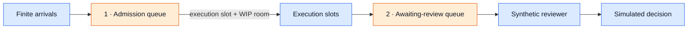

# Design

## Question, hypothesis and boundary

Question: how does accepted output change when execution capacity increases but
review capacity stays fixed, and where does waiting move under a WIP limit?

Prediction: with the selected workload, four execution slots will increase work
waiting for review, while accepted output will grow less than fourfold. A WIP
limit of three may keep the reviewer supplied while moving some waiting to the
admission queue. These are predictions, not observed results or universal laws.

The boundary includes finite arrivals, uniform execution demand, one synthetic
reviewer, FIFO scheduling and accept-all simulated decisions. It excludes output
quality, rework, priorities, stochastic service times, worker failures and human
fatigue. The reviewer is a modeled operator, distinct from the Reviewer agent.

## Fixed initial scenario

Time uses integer logical ticks, not wall-clock seconds. Arrive before admitting
work; service completes after the configured positive duration. All comparisons
use the same task IDs and arrival list.

| Input | Value |
| --- | --- |
| Workload | 24 tasks, arriving at ticks 0, 2, ..., 46 |
| Automated service per task | 8 ticks total |
| Synthetic review service | 6 ticks; one reviewer |
| Review outcome | Every modeled decision accepts |
| Observation window | Tick 0 through tick 60, including events at tick 60 |
| Completion observation | Continue draining after arrivals stop; bound at tick 500 |
| Ordering | FIFO by arrival and task ID; review FIFO by ready time and task ID |

| Policy | Execution slots | Total WIP limit |
| --- | ---: | ---: |
| A: baseline | 1 | None |
| B: more execution | 4 | None |
| C: bounded WIP | 4 | 3 |

Eight execution ticks are an abstract service demand; they do not measure the
Researcher, Builder or Reviewer implementations. Four slots mean four parallel
modeled workflows, not four new specialist roles. Arrival rate is one task per
two ticks. Nominal execution capacities are one/eight and four/eight tasks per
tick; review capacity is one/six. Startup, the finite horizon and idle periods
must be included when computing observations.

## State and admission

Queue count: two. Both queues are in-memory model state, not external services.
Each task progresses through `queued -> executing -> awaiting_review ->
reviewing -> decided`. Total WIP includes executing, awaiting-review and
reviewing tasks. A modeled decision releases the WIP slot; finishing automated
execution releases only the execution slot. Admission requires both capacities.
The admission queue stays visible and is not counted as admitted WIP.

At the same tick, complete active services, register arrivals, enqueue completed
execution, start the next review, then admit FIFO tasks into free execution
slots. Resolve ties by stable task ID. Apply transitions atomically before
recording the occupancy sample for that tick. All service durations are positive;
no zero-time service or polling/sleep loop is needed.

## Evidence and metrics

Record each task's arrival, admission/execution start, review-ready, review-start
and simulated-decision tick. Stable event identities use scenario hash, policy,
task ID and transition; array order supplies a deterministic sequence.

Derived metrics include:

- Admission wait: admission minus scheduled arrival.
- Review queue wait: review start minus review-ready, excluding review service.
- End-to-end time: simulated decision minus scheduled arrival.
- Accepted output at tick 60 and throughput over the common 60-tick window.
- Upstream queue, review queue, execution occupancy, reviewer occupancy and WIP.
- Peak queue sizes, time-weighted queue occupancy, reviewer utilization, and
  median/p95 waits for completed tasks, with sample counts.
- Pending tasks at tick 60, oldest pending age, and full-drain makespan measured
  from the first scheduled arrival.

For each snapshot, arrivals equal queued + executing + awaiting-review +
reviewing + decided. Execution occupancy cannot exceed its slots; reviewer
occupancy cannot exceed one. Under policy C, admitted WIP cannot exceed three.
Time-weighted metrics integrate right-continuous post-transition states between
event ticks; the final interval ends at the stated horizon. Percentiles use the
documented nearest-rank method and return unavailable for zero observations.

Report fixed-window counts alongside pending work. Compare full-drain latency
over all 24 tasks separately; do not compare only each policy's fast completions
as though their samples matched. A WIP limit cannot create review capacity or
be described as eliminating waiting without counting the upstream queue.

## Model, exports and trust

Use `src/systems_lab/review_capacity.py` for pure validated computation independent
of LangChain, LangGraph, Store and the journal. Proposed discovery commands are
`systems-lab experiment review-capacity --scenario PATH` and
`make review-capacity-demo`; implementation will add and document these targets.

Inputs are JSON with a fixed schema/model version. Initial implementation bounds
tasks to 1..100, execution slots to 1..8, positive integer service durations to
1..100 ticks, last arrival and observation horizon to 0..10000 ticks, and drain
deadline to at most 50000 ticks. Reject unknown fields, booleans as numbers,
invalid ordering, nonpositive limits and non-finite values. Never load code or
arbitrary URLs from the scenario. An exhausted drain bound is an explicit
incomplete result, not success.

Write each attempt exclusively under
`.lab/experiments/review-capacity/<attempt-id>/`. A complete directory contains
`scenario.json`, `report.json` and `manifest.json`; publish a manifest only after
both data files are complete. The deterministic report contains inputs, model
version, policies, traces, metrics, limitations and
`provenance=synthetic_event_time_model`. Attempt ID and wall-clock creation time
belong to the manifest, outside the deterministic report hash. Repeating an
input creates a new attempt with the same report bytes/hash; it never overwrites
earlier files. Local owner modification remains possible and must be disclosed.

Neither `Store.decide`, `run.decision`, worker lifecycle events nor workflow OTLP
spans represent these model transitions. Experiment exports are a distinct
source; they must not be merged into existing run counts or ledger guarantees.

## Dashboard

Add an Experiments view beside Activity. A prominent **SIMULATION REPLAY** badge
and logical-tick axis remain visible, including on exported screenshots. The
local gateway reads only complete, bounded, hash-checked attempt directories
from its configured `.lab/experiments/review-capacity` root. Authenticated viewer
GET endpoints expose a report list and selected report using validated IDs;
caller-provided filesystem paths are never accepted. Report content is rendered
as text, not executable HTML. Runtime-generated reports stay out of Git.

The view has:

1. A fixed comparison table for A/B/C and their observed metrics.
2. Queue and cumulative-decision charts using the existing static frontend and SVG.
3. A selected-policy flow view with the two queues, execution slots, reviewer and
   admitted WIP, animated from recorded logical transitions.
4. Local play/pause, seek and speed controls. Replay never launches a workflow,
   writes a decision or changes a report. Reduced motion disables animation.

Fetch the report once and replay locally. Interrupted loading reports an error;
there is no LIVE indicator or polling-based operational health claim. Existing
Activity stale/reconnect behavior stays independent. First acceptance covers the
local dashboard only; container report mounting/import is a later requirement.

## Delivery slices and subsequent operational validation

Slice 1: pure model, behavior tests, fixed JSON scenario and CLI exports.
Slice 2: bounded read-only report loading and dashboard comparison/replay.
Slice 3: reconcile outputs, document observations and capture the interface.
These slices form v0.2. No new infrastructure or third-party dependency is needed.

After v0.2, scope a separate runtime admission experiment. Use the existing
fixture graph and gateway to validate that admitted workflows really reach
`awaiting_review`, carry separate identities and close worker access. Preserve
operator-driven, digest-bound decisions. A concurrent launcher must first define
single-writer admission ownership, checkpoint isolation, SQLite contention,
failure/revocation release and restart recovery. Shared thread IDs alone do not
provide these properties. Actual execution timing belongs to operational events;
synthetic timing must never be attributed to real workers or people.

The runtime validation and a subsequent live-model specialist are deliberately
separate changes, each with their own hypothesis and acceptance evidence.
