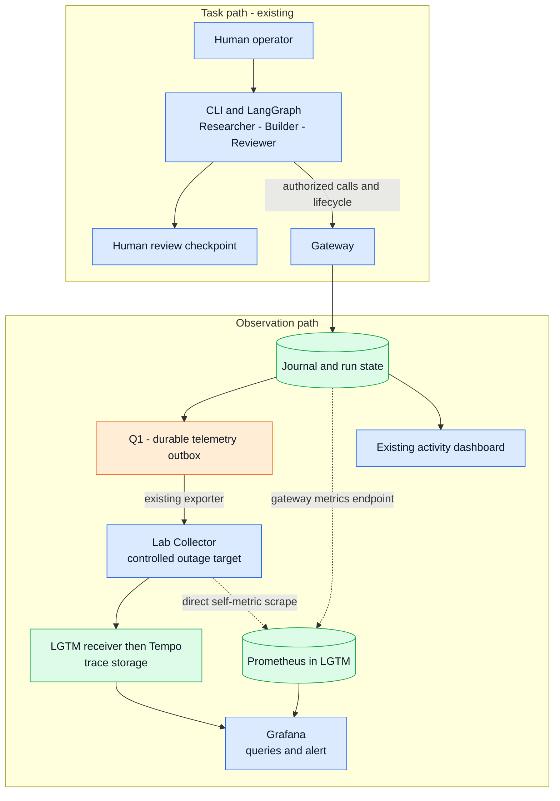

# Agent Telemetry Reliability Lab: learning plan

Status: **proposal for review; implementation has not started**.
Prepared on 6 October 2026. Repository observations below come from source and
configuration inspection, not a live run. Technical artifacts are in English;
the accompanying explanation to the learner is in Spanish.

## Start with one apparently stuck task

You are running the lab and see no new activity. Before restarting anything,
you want to know whether the Builder is still working, a worker failed, a human
decision is pending, or information stopped reaching the screen.

Imagine a fixture run reaches its human review checkpoint just as the Collector
stops. Grafana shows an incomplete trace. The existing activity dashboard still
shows `awaiting_review`, and the gateway has events waiting for delivery. There
are two simultaneous facts: the task needs a person, and telemetry delivery
needs repair. Restarting the task would not explain either fact.

The first user is you, the lab operator and learner. Success means being able
to explain this situation with evidence, then reproduce the explanation without
depending on an AI-generated dashboard. A later engineering-management interview
may benefit from this example, but learning and a useful lab diagnostic come first.

## Vocabulary for this experiment

| Term | Everyday meaning here |
| --- | --- |
| Run | One execution of the three-specialist workflow, identified by `run_id`. |
| Gateway | The lab's doorkeeper: it checks permissions, executes registered operations and records what happened. |
| Journal | The database's ordered historical record. It is the reference for events, not Grafana. |
| Outbox | A persistent list of journal events still waiting for telemetry acknowledgement. It contains observations, not tasks waiting to execute. |
| OpenTelemetry / OTLP | Tools and conventions for describing observations; OTLP is the protocol used to send them. |
| Span / trace | A span describes one observed event or operation. A trace groups related spans under one ID; here one run has one trace ID. |
| Metric | A number sampled over time, such as how many events are waiting for delivery. |
| Collector | A receiver and forwarder for observations. It does not run or authorize agent tasks. |
| Tempo / Prometheus | The proposed stores for traces and numerical time series, respectively. |
| Grafana | The interface for querying those stores, displaying panels and evaluating an alert. |
| Scrape | Prometheus periodically asks an endpoint for its current metrics. |

## Verified starting point: planning snapshot

The following observations describe the checkout before synchronization. They
are retained as provenance, rather than a description of the current Git state.

Primary checkout: `docs/dashboard-guide`, HEAD
`948564606fe7dd70aced53d1389793c35bd77362`. Its pre-existing untracked
`docs/openspec/changes/review-capacity-experiment/` remains untouched. The local
tracking ref reports the branch behind by one commit; no remote refresh was made.

Related checkout: `/Users/saski/Code/agent-systems-lab_worktrees/review-capacity-v02`,
branch `feat/review-capacity-v02`, HEAD
`61a5c31c6babf882d28f4a1fddd5933f71c8b470`. It contains existing modified and
untracked Review Capacity implementation, tests and documentation. The telemetry,
journal, activity, Compose and observability files inspected are identical in
both checkouts. No branch was switched and no work was copied between them.

Line references below refer to the primary checkout at the stated HEAD.

| Existing evidence | What it establishes | Missing piece proposed here |
| --- | --- | --- |
| [Gateway](../../src/systems_lab/gateway.py), lines 115–197 | Delivery lifecycle, viewer-authenticated activity reads and a basic health endpoint | An authenticated metrics read, with real data freshness rather than just process health |
| [Journal](../../src/systems_lab/journal.py), lines 22–27, 153–242, 302–338 | Stable IDs; event and outbox committed together; pending selection and acknowledgements | Read-only aggregate metrics and a bounded comparison with Tempo |
| [Telemetry](../../src/systems_lab/telemetry.py), lines 85–124, 158–236 | Explicit OTLP/HTTP destination, journal-event spans, allowlisted attributes and measured completion durations | A searchable trace backend and learning queries |
| [Activity projection](../../src/systems_lab/activity.py), lines 11–51, 56–89 | Human-review stage; unknown worker after 120 seconds; delivery status; latest 100 runs | Grafana overview without using that 100-run window as a global count |
| [Collector configuration](../../observability/collector.yaml) and [Compose](../../compose.yaml), lines 46–74 | Optional `observability` service; trace input and file output only; loopback port 4318 | Forwarding to a local backend, direct metric scraping and reproducible Grafana resources |
| [Store](../../src/systems_lab/store.py), lines 318–424; [executor](../../src/systems_lab/orchestrator.py), lines 109–138 | Explicit review state, digest-bound decisions, measured operations, worker failure/timeout and revocation | Small, deliberate fixture fault exercises |
| [Delivery guide](../observability.md), lines 85–107, 126–145; [tests](../../tests/test_telemetry.py) | Documented at-least-once boundary and test cases for retry/restart, redaction and integrity failure | Actual Tempo/Grafana integration evidence; these tests were read, not rerun for this plan |

Important interpretation limits:

- `run.create` and `worker.started` are event spans, often with zero duration.
  Worker completion spans derive elapsed time from lifecycle timestamps; tool
  and model completion durations use the gateway's operation timer. This is not
  complete instrumentation inside workers, nor a conventional enclosing root
  span measuring all work. A trace's overall time extent may include human wait.
- A `run.decision` span does not export the private `detail` field containing
  accepted/rejected status. Read that outcome from gateway state; do not infer it
  from the trace's `allow` decision. A policy denial is not necessarily a crash.
- Review Capacity's implementation exists in the secondary working tree. Its
  experiment guide and `review_capacity.py` use logical ticks and a synthetic
  reviewer. Those results must not become wall-clock latency or live worker
  telemetry. This proposal uses the existing real fixture workflow instead.

## Proposed local design



Solid arrows carry task actions or recorded events; dotted arrows are metric
reads. Q1 is the one application delivery queue: the journal produces entries
and the exporter consumes them. Journal and outbox are tables in the same
database. Collector/backend transport buffers are separate implementation
details, not additional task queues or durable guarantees in this first lesson.

**Recommendation:** reuse the lab Collector as an independently stoppable
service and add `grafana/otel-lgtm` as the local backend. The bundle includes its
own Collector receiver; two receivers therefore exist intentionally. Stopping
the lab Collector must leave Grafana and Prometheus running. Sending directly
to the bundle would remove one hop, but stopping its whole container would
also remove the observer needed for the principal exercise. Separate Tempo,
Prometheus and Grafana containers remain a possible later decomposition.

Grafana documents this bundle for development, testing and demos. That matches
this experiment. Its configurable backends and file-mounted dashboards support
the proposed local setup. Choose and record a tested image tag and digest during
implementation; do not commit a floating `latest` reference. No particular image
version, memory requirement or startup time has been verified on this machine.
See [LGTM documentation](https://grafana.com/docs/opentelemetry/docker-lgtm/) and
the [official repository](https://github.com/grafana/docker-otel-lgtm).

The upstream [Collector configuration](https://github.com/grafana/docker-otel-lgtm/blob/main/docker/otelcol-config.yaml)
routes traces to Tempo and collects its own metrics through itself. That
self-monitoring route alone cannot cover a stopped Collector. The upstream
[Prometheus configuration](https://github.com/grafana/docker-otel-lgtm/blob/main/docker/prometheus.yaml)
also does not already define the lab's proposed direct scrape targets.

### Boundaries to preserve

- Add a separate opt-in Compose override, `observability/grafana/compose.yaml`.
  Keep the existing file-export profile usable. Use the existing gateway and
  its Postgres history for the taught container path; do not also launch the
  SQLite dashboard on port 8765. One exporter process per database remains the
  supported topology. New runs provide evidence at the new destination; already
  acknowledged history is not automatically replayed.
- Record the existing run counts and pending backlog before the first exercise.
  An enabled destination may receive previously pending events. Let that backlog
  settle, or report it explicitly; do not clear it to obtain a clean chart.
  Compare new-run deltas with the recorded baseline, not an assumed empty lab.
- Preserve `http://otel-collector:4318/v1/traces` as the gateway destination in
  this profile. The Collector forwards to the LGTM receiver using internal
  service DNS. Do not publish a second host port 4318. Publish Grafana only on
  loopback, normally 3000; preflight occupied ports instead of stopping services.
- Attach observation services to a dedicated internal telemetry network, not
  the workers or database network. LGTM may also use the operator-facing bridge
  for its loopback UI. The gateway joins telemetry while retaining its required
  existing networks. In the optional override, fully replace `otel-collector`
  networks with `!override [telemetry]` and its host ports with `!override []`:
  this lesson uses container-to-container ingestion, and an ordinary merge could
  retain its old database-network attachment. Verify the resolved config lists
  no `control` or `workers` network on either observation service. Preserve the
  fixed worker network name. Add no worker egress, host credentials, Docker
  socket, host PID namespace, privileged mode or automatic host instrumentation.
  [Docker documents `!override` for Compose 2.24.4 and later](https://docs.docker.com/reference/compose-file/merge/#replace-value).
  The installed Compose CLI reports 5.2.0; daemon and runtime behavior remain
  unverified. Require the supported version for this optional profile only.
- Store new local LGTM runtime data under ignored `.lab/observability/`, with
  validated ownership. Retain existing database and telemetry volumes. Stop
  services without deleting data. No provider keys, external OTLP forwarding or
  backend usage-reporting integration is part of the local profile.
- Reuse the viewer permission for `/metrics`; mount only the viewer token file
  read-only into Prometheus, never the operator token or the entire `.lab/`.
  Authentication headers are transport configuration, never telemetry labels,
  dashboard fields or saved evidence. [Prometheus supports a credentials file](https://prometheus.io/docs/prometheus/latest/configuration/configuration/#http_config).
- Keep the export allowlist. Do not add automatic HTTP/body instrumentation or
  arbitrary resource attributes. Prompts, credentials, tool arguments, content,
  raw exception messages and user-supplied text remain outside telemetry.

## Five application metrics, one alert

Use OpenTelemetry metrics with its Prometheus exporter. Prometheus scrapes the
gateway directly, so these readings do not traverse either Collector. This
teaches both OTLP trace delivery and metric collection without adding another
push pipeline. [OpenTelemetry documents this exporter and collection model](https://opentelemetry.io/docs/languages/python/exporters/#prometheus).

Proposed Prometheus-facing names below are contracts to verify against the
selected SDK/exporter versions. None exists yet.

| Metric | Type and meaning | Allowed variable labels |
| --- | --- | --- |
| `lab_runs` | Gauge: distinct runs currently in each state, from run rows, across the chosen database | `state`: running, awaiting_review, accepted, rejected, revoked |
| `lab_telemetry_pending_events` | Gauge: undelivered outbox rows; not tasks | None |
| `lab_telemetry_oldest_pending_age_seconds` | Gauge: current time minus the oldest pending event timestamp; zero only when the queue was successfully read and is empty | None |
| `lab_telemetry_export_enabled` | Gauge: exporter enabled, 1 or 0; disabled is not healthy delivery | None |
| `lab_metrics_snapshot_timestamp_seconds` | Gauge: time of a successful database snapshot for this scrape | None |

The dashboard must prominently label the context as fixture-backed,
gateway-observed activity with wall-clock seconds. A `running` run row alone is
not proof that its worker is healthy; use lifecycle evidence and freshness.

Read aggregates from a consistent database snapshot, independently of the
dashboard's 100-run limit. Explicitly emit zero-valued state buckets when a
successful read finds no runs in them. A database read failure must fail the
scrape, not return zero or refresh a cached snapshot's timestamp. Preserve
read-only behavior and avoid a new writer or persisted metric ledger.

Serve the SDK-backed exposition through the gateway's FastAPI `GET /metrics`
route with `Depends(viewer)`, not the exporter's standalone HTTP-server example.
Read the snapshot before rendering; metric callbacks must observe that same
successful snapshot. If it cannot be read, return HTTP 503 and no synthetic
measurements. Test unauthenticated access, snapshot failure and repeated app
lifecycle; do not open an unauthenticated second metrics listener. Limit resource
attributes and published metric families deliberately when wiring the exporter.

Also show Prometheus's built-in `up` for fixed jobs `lab-gateway` and
`lab-collector`. Configure the latter's internal metrics endpoint on the private
network, scraped directly, not through its OTLP pipeline. This is endpoint
reachability, not proof of downstream acceptance or retention. Current Collector
docs use `service.telemetry.metrics.readers`; the older `address` setting is
ignored in recent versions. Verify actual names for the pinned image before
using diagnostic queue/error metrics. [Collector internal telemetry](https://opentelemetry.io/docs/collector/internal-telemetry/)

Keep only the bounded state label plus fixed deployment labels such as job and
service. `run_id`, actor instance IDs, event IDs, trace/span IDs and hashes stay
in traces or local comparison evidence. Every different label combination
creates another stored series: putting each task ID in a metric would make
storage and queries grow with every task. [Prometheus naming guidance](https://prometheus.io/docs/practices/naming/)

No run counts or duration histograms will be generated from received spans in
v1. A retransmitted span is another delivery of an observation, not another
task. State gauges also avoid a new durable counter projection. Operation
duration is inspected in traces; review waiting is a separate state.

The proposed Grafana-managed rule, `LabTelemetryNeedsAttention`, has this truth
table, to be tested before its query is finalized:

- Attention when enabled delivery has pending events older than 10 seconds,
  either required scrape target reports `up=0`, or its successful snapshot is
  over 15 seconds old.
- Detect missing expected targets/series explicitly; a surviving series must
  not hide another missing series. Whole-query No Data or Error remains visible
  as an attention state, never Normal or a retained green value.
- Fresh successful reads, an enabled exporter, both targets up and an empty
  outbox are normal even if every run is awaiting review. Disabled export gets
  its own visible label and is not described as successful delivery.
- Start with 5-second scrapes and evaluations, a 10-second pending period, and
  a 60-second observation budget for the exercise. These are teaching settings,
  not a production service-level commitment. Record actual detection time.

Use one provisioned rule and its health/No Data/Error states. Show it in the
local UI; no email, Slack, webhook or external notification destination.
[Grafana's documented No Data and Error behavior](https://grafana.com/docs/grafana/latest/alerting/fundamentals/alert-rule-evaluation/nodata-and-error-states/)
must be checked for the bundled version. Panels must leave gaps and state
`No data`/`Stale`; never use blanket null-to-zero or `or vector(0)` substitutions.

## Experiments and diagnoses

Hypothesis: independent state and delivery observations let a learner distinguish
execution trouble, a human checkpoint and a telemetry interruption. After a
bounded receiver outage, pending observations become queryable with their original
identities while canonical task history remains unchanged by delivery retries.

Boundary: one local operator, one gateway/database, fixture workers, the lab
Collector and the local LGTM bundle. Controlled variables: same fixture, versions,
permissions, machine, scrape intervals and small run count. Change one factor at
a time: worker delay, worker failure or Collector availability. Use wall-clock
seconds for actual execution and delivery; no Review Capacity ticks enter this
experiment. Record run/trace IDs, UTC observation timestamps, configuration
revision, fault onset/recovery, executor, model mode and unique evidence counts.

| Case | Deliberate intervention | Evidence and interpretation |
| --- | --- | --- |
| Normal | Run one existing fixture workflow | Find its trace and successful worker completion; gateway ends at `awaiting_review`; pending delivery drains. This is completion of automated work, not human acceptance. |
| Human review | Leave that decision pending | `run.ready`, state `awaiting_review`, healthy collection and fresh data. Quiet activity is expected. A human rejection is also a business outcome, not automatically a technical incident. |
| Slow worker | Opt in to a fixed 5-second delay for Builder, after its recorded start, on one new fixture run | While active, the gateway shows running; after completion the worker span includes the delay. Gateway operation spans need not show that delay. No synthetic span timestamps or new permissions. |
| Failed worker | Opt in to a controlled nonzero Builder exit on one new fixture run | `worker.failed` and run revocation from the existing executor path. A red policy-denial span alone would not establish this diagnosis. |
| Collector unavailable | Stop only the lab Collector, then create one fixture run | Gateway and its original dashboard remain available; direct gateway metrics stay fresh, Collector `up` falls, pending count/age rise, and the alert requires attention. |
| Recovery | Restart that Collector without clearing state | Pending events drain; the same trace becomes more complete at original event times. Compare identities, not received-span counts. Alert returns to Normal after fresh successful readings. |
| Missing data | Make only the metrics read unavailable in an isolated test; also test a missing target/series | Visible missing/stale/error evidence, not a healthy zero. An empty but healthy lab instead supplies real zeros. |

Future fault hooks belong to a bounded fixture-only demo path in the trusted
CLI/worker launcher: fixed cases, one selected role/run, maximum delay 5 seconds,
off by default. They must exercise the real lifecycle and permission path, reject
unknown/live modes, and never accept arbitrary commands. The host operator owns
Collector stop/start; no worker or Grafana action obtains that ability. A worker
timeout beyond the existing 90 seconds is optional after the short failure lesson.

### Detecting observation loss honestly

Use three different questions:

1. **Is delivery interrupted before acknowledgement?** Inspect the direct scrape
   and gateway outbox. These survive a stopped lab Collector. No new events means
   no pending backlog may form; `up` still tests reachability.
2. **Did all expected observations become queryable?** For a small frozen run,
   record a journal sequence boundary and expected `(trace_id, span_id)` set.
   Compare it with a complete trace lookup from Tempo, deduplicating IDs. Include
   all pages/limits on the journal side and reject partial/pruned/truncated trace
   responses. Match timestamps/actions as well as identities. Query the original
   event interval, not only the recovery time. [Tempo trace lookup API](https://grafana.com/docs/tempo/latest/api_docs/)
3. **Is the observation system itself unavailable?** If the whole LGTM container
   is down, its Grafana alert cannot work. Use the existing gateway dashboard and
   a bounded host-side reachability check. This is a shared failure domain, not
   highly available monitoring.

An acknowledgement proves acceptance by the next receiver, not durable retention
in Tempo. Collector memory queues, crashes, filtering, exhausted retries and disk
failure can produce a downstream gap after acknowledgement. The existing file
output is a troubleshooting copy, not automatic replay or immutable storage.
The first recovery claim covers a stopped ingress Collector and the durable
gateway outbox. Persisted Collector forwarding queues and their failure tests are
a later extension. [OpenTelemetry resiliency guidance](https://opentelemetry.io/docs/collector/resiliency/)

In future validation, a controlled receiver/filter test must accept a fixture
batch while omitting one known span downstream. The comparison must report that
ID missing even with an empty outbox. Report `not found after 60 seconds`, with
query completeness and time range, rather than asserting irreversible loss from
an empty screen. Do not reset delivery flags, rewrite journal events or invent a
new event to repair the demonstration. No continuous reconciliation daemon is
needed for this finite experiment.

## Learning slices

Assume basic terminal/Python familiarity, a working Docker installation, assisted
implementation between exercises and a small fixture dataset. Allow roughly
**7–11 hours of active learning and implementation**, spread across sessions.
Image downloads, Docker repair, occupied ports and version incompatibilities are
additional uncertainty; these are estimates, not promised completion times.

| Slice | What you learn | Proposed change | What you personally do | Visible result and verification | Estimate |
| --- | --- | --- | --- | --- | --- |
| 0. Follow the task | Permission, execution and human decision are separate | Establish a baseline using existing commands; record fresh run/trace IDs | Predict where the run will stop; inspect its artifacts and explain `awaiting_review` | Original dashboard and journal agree; no decision was fabricated | 0.5–1 h |
| 1. Find its trace | A trace groups observed events; collection is a separate route | Add the opt-in backend and forwarding config, pin versions, provision data sources | Paste the trace ID in Grafana Explore; inspect Builder completion and distinguish it from `run.create` | Same IDs and original timestamps in journal and Tempo; one fresh run becomes queryable within the tested budget | 1.5–2.5 h |
| 2. Read useful numbers | Metrics, labels, independent collection and absence | Add five read-only OTel metrics and a small dashboard | Write a query for review-pending runs and one for pending events; compare an empty queue with an unavailable endpoint | Auth/aggregation tests pass; replay does not increase run count; missing data is visibly different from zero | 2–3 h |
| 3. Diagnose an intervention | Slow work, failure, pending review and missing observations differ | Add bounded fault cases, direct Collector scrape, one alert and finite reconciliation | Predict the signal for each fault, introduce it, name two pieces of evidence, then recover | Controlled failure visible; alert changes state; recovery retains IDs; accepted-but-missing test is detected | 2–3 h |
| 4. Explain and reproduce | A claim needs evidence and a boundary | Finish provisioning, startup guide, demo script and evidence notes | Recreate provisioned views, run the three-minute demo, explain a duplicate and a missing-data case without assistance | Automated checks plus manual UI review pass; another checkout can follow the guide after authorized setup | 1–1.5 h |

Do not move to the next slice merely because code exists. End each session with
one prediction, one observed result and one limitation in your own words. Phase 0
is an early checkpoint to simplify the next session if the lab remains confusing.

Short query exercises, proposed for the chosen versions:

```text
TraceQL: { span.lab.run_id = "<run-id>" }
TraceQL: { span.lab.action = "worker.failed" }
TraceQL: { span.lab.action = "worker.completed" && span:duration > 4s }
PromQL:  lab_runs{state="awaiting_review"}
PromQL:  lab_telemetry_pending_events
PromQL:  up{job="lab-collector"}
PromQL:  absent_over_time(lab_metrics_snapshot_timestamp_seconds{job="lab-gateway"}[15s])
```

Explain why the slow-worker query is more appropriate here than overall trace
duration. Explain why a retry changes delivery evidence but not `lab_runs`.
Explain why an old sample is insufficient to conclude that the current value is
zero. The syntax follows [TraceQL](https://grafana.com/docs/tempo/latest/traceql/construct-traceql-queries/)
and [Prometheus functions](https://prometheus.io/docs/prometheus/latest/querying/functions/);
live exercises remain unverified until the selected versions are running.

## Implementation map and future acceptance

All paths in this table are proposals, not files implemented by this plan.

| Area | Expected files | Acceptance evidence |
| --- | --- | --- |
| Optional stack | `observability/grafana/compose.yaml`, `collector.yaml`, `prometheus.yaml`; `Makefile` | Effective Compose config preserves isolation, host ports and data; pinned backend starts when explicitly requested |
| Metrics | `src/systems_lab/metrics.py`, narrow changes to `gateway.py` and `journal.py`; `pyproject.toml`, `uv.lock` | Viewer-only reads; accurate state counts beyond 100 runs; consistent snapshots; no sensitive labels or false zeros |
| Reproducible UI | `observability/grafana/provisioning/`, `observability/grafana/dashboards/agent-telemetry-reliability.json` | Same sources, dashboard and alert from files; screen has freshness, run states, backlog/age and a trace drill-down |
| Fault exercise | `src/systems_lab/cli.py`, `orchestrator.py`, `worker.py`, or a small dedicated demo module | Scoped fixture delay/failure reaches existing lifecycle handling; unknown cases rejected; normal execution unchanged |
| Evidence comparison | Bounded read-only command/helper and `tests/test_observability_integration.py` | Expected unique spans present after recovery; duplicate delivery tolerated; known missing span detected; incomplete queries never pass |
| Learning material | `experiments/agent-telemetry-reliability/README.md`, `demo.md`; small updates to `docs/observability.md`, `docs/development.md`, `README.md` | Hypothesis, variables, inputs, actual observations, limits, startup/stop/recovery instructions and demo are readable and repeatable |

Keep dependencies under `uv` and the lockfile. Before changing Python or Make
targets, reload their contextual rules. Begin behavior changes with a failing
behavior test when practical: retry versus task count, empty versus unavailable
metrics, review versus failure, sensitive sentinel exclusion, and missing spans
after acknowledgement. Use isolated temporary data, not the user's history.

Future checks: relevant pytest tests while iterating; `make check`,
`make spec-check`, and `git diff --check` for the finished implementation. Add a
canonical Make target for opt-in LGTM integration checks before documenting it as
available. Run the existing container isolation suite plus the new integration
target only after implementation and service-start authorization. Check actual
UI rendering and query/alert outcomes, not just HTTP status or container health.

Proposed Make target names are `grafana-up`, `grafana-down`, `grafana-demo` and
`grafana-check`; **none is available yet**. They should encapsulate the explicit
base/override files and required profiles. Starting services stays explicit;
`grafana-check` tests a deliberately started stack. Save comparison evidence as
only IDs, actions, timestamps, hashes, versions and counts, not full API bodies.

Acceptance requires following one run ID into its trace; diagnosing the known
fault from specific events and independent metrics; seeing pending delivery
recover without new canonical events; verifying the existing journal prefix and
hash checkpoint still agree; preserving timestamps/IDs on resend; demonstrating
missing data versus zero; and proving that a viewer cannot grant, approve or
revoke. A duplicate-receive test must simulate receiver acceptance followed by
local acknowledgement failure. Backend deduplication must be observed, not assumed.

## Three-minute demonstration to prepare

Prerequisite: images already available, stack ready, panels provisioned, versions
recorded, and one trace from each short worker fault prepared. Setup and image
downloads are not part of the three minutes. The exact timing must be rehearsed.

| Time | Your action and explanation |
| --- | --- |
| 0:00–0:35 | Show a fresh normal run, its ID and trace. Point out the completed specialists and `awaiting_review`: the next action belongs to a person. |
| 0:35–1:00 | Open the prepared slow/failed Builder traces. Identify the measured worker duration or `worker.failed`; distinguish a technical failure from a review checkpoint. |
| 1:00–1:40 | Stop only the lab Collector and create one small run. Show that the gateway still advances, its direct metrics remain fresh, the Collector target fails and pending events accumulate. Show alert attention if the tested timing budget permits. |
| 1:40–2:25 | Restart the Collector. Watch the queue drain, reopen the same trace, and compare expected unique IDs with query results. The graph uses event time, so recovered events may appear earlier in the timeline. |
| 2:25–3:00 | Explain that a resend is not a new task, zero needs a successful read, and next-hop acceptance is not a permanent-storage guarantee. Show the saved missing-span test result and note the whole-stack outage limit. |

Record what actually occurred; lengthen the demonstration or label a prepared
capture when recovery takes longer. Never shorten configured waits secretly or
present a prerecorded result as a live one. Actual results remain unmeasured.

## Decisions and deferred work

The first version answers where a fixture workflow is waiting and whether its
observations reached the local backend. It leaves permissions and historical
truth in the gateway, and produces reproducible configuration, one dashboard,
one rule, a startup guide, a demo and original local evidence under `.lab/`.
[Grafana provisioning](https://grafana.com/docs/grafana/latest/administration/provisioning/)
and [alert provisioning](https://grafana.com/docs/grafana/latest/alerting/set-up/provision-alerting-resources/file-provisioning/)
provide the intended file-based delivery mechanism.

Defer correlated application logs, duration histograms, full worker tracing,
OTLP metric push, persistent downstream forwarding/replay, continuous loss
reconciliation, retention engineering and production availability. These each add
concepts or reliability claims beyond the first diagnostic. Loki or other
services included by the bundle do not imply application integration with them.

No Kubernetes, fleet management, paid model route, Grafana Cloud subscription,
public deployment, new control plane or automatic human decisions are included.
The professional takeaway is an evidence-backed discussion of ingestion,
backpressure, missing signals and tradeoffs; this experiment does not demonstrate
production Ingest scale or model quality.

## Planning record

The related [OpenSpec proposal](../openspec/changes/agent-telemetry-reliability/proposal.md)
contains the reviewable acceptance contract and pending tasks. Existing
specifications and the unrelated Review Capacity proposal are not modified.
Current planning validation will be recorded there. This plan authorizes no
implementation or service execution by itself.

### Publication checkpoint: 6 October 2026

After the planning inspection, the primary checkout's local `main` was advanced
to remote `main` at `8bf1669a68a9072326d35abfb18ee979a3766531`. The published
Review Capacity simulation and learning guide are now present in this checkout.
The four older untracked Review Capacity drafts were preserved in an ignored
local backup before replacing them with the tracked published versions. The
five new telemetry documents were preserved byte-for-byte during synchronization;
the separate implementation checkout was not changed.

Publication validation passed `make check` (83 tests passed; five opt-in
container tests skipped, plus lint, formatting and Compose validation) and
`make spec-check` (five items). Local links, code fences and whitespace were
checked. These checks validate the existing repository and proposal structure;
the telemetry experiment is still unimplemented and its runtime outcomes remain
unverified. No experiment service was started for this publication.
