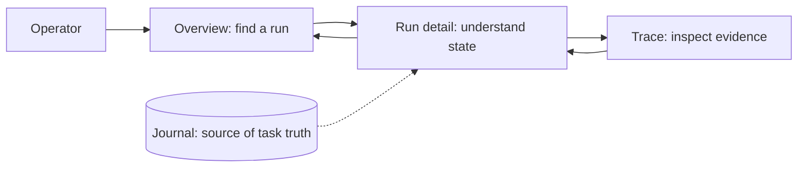

# Grafana Frontend: bounded learning alignment

Status: **research and proposal only; not implemented**.
Prepared October 7, 2026. Adds a product/frontend learning track to the
[existing telemetry reliability proposal](2026-10-06-agent-telemetry-reliability-lab.md).
It does not replace that proposal, approve its implementation or change the
gateway, permissions, agent runtime or funding boundaries.

## Why Adjust The Learning Goal

The learner now prioritizes a frontend engineering-management opportunity.
The most useful additional question is not simply whether telemetry arrives,
but whether a person can find the right resource, understand its state and keep
context while moving between views.

Keep the existing distinction between execution, human review and observation
delivery. Add a narrow interface/navigation lesson around it. This remains a
useful lab experiment, not a reconstruction of Grafana's production platform or
proof of professional open-source leadership.

## Observed Starting Point

Re-inspection on October 7 of the primary checkout at `13b7ac6` found:

- A read-only browser dashboard in `src/systems_lab/static/`, using JavaScript,
  DOM rendering and authenticated same-origin API reads; no React application.
- Journal state, run selection and a trace ID are already visible. Stale-feed
  handling and some keyboard/ARIA behavior exist; no new accessibility audit was
  run, so do not claim either complete compliance or total absence of support.
- The Collector exports to a local file; no Grafana frontend extension or live
  Grafana integration is demonstrated by this checkout.
- The October6 integration plan is still explicitly a proposal. Its future
  target names must not be presented as current commands.

Current branch: `docs/agent-telemetry-reliability-proposal`. GitHub metadata for
[PR #2](https://github.com/saski/agent-systems-lab/pull/2) reports open and not
merged, with head `13b7ac61c707329f3109e7c1a801ca469d57b5a9`. The pre-existing
README link and this untracked addendum were present before this refinement.
The README and other worktrees were left untouched. The chat
"Aprender Grafana con Agent Systems Lab" was read as historical context; the
current checkout and PR were checked separately.

The [current UI source](../../src/systems_lab/static/app.js) keeps run selection
in memory and renders the trace ID as text. It has keyboard activation on run
rows, empty/detail states and a stale-feed indicator. No URL-based run selection
or Grafana trace link was found. A run-detail fetch failure currently reaches a
console warning; a complete visible loading/error contract is not established.
These are static observations, not a browser accessibility or usability result.

The [lab Collector image](../../observability/Dockerfile) is
`otel/opentelemetry-collector-contrib:0.161.0`; its
[configuration](../../observability/collector.yaml) exports traces to a file.
There is no selected LGTM image in the current Compose configuration. Source
and existing tests support the journal/outbox/OTLP implementation, but were not
executed again for this documentation task.

Only documentation was changed for this addendum. No Grafana/browser session
or containers were exercised for the proposed learning track. Existing automated
repository checks are recorded separately below. Other worktrees remain outside
its modification scope.

## One Concrete Story

An operator sees a run that has apparently stopped. They locate it, open its
detail and follow its trace. They discover that the work is waiting for a human,
while some observations are delayed. They return to the overview without losing
the selected run or relevant time context.

This is a proposed user journey, not an implemented routing architecture.
Grafana is a diagnostic interface, not an authority to approve tasks or change
gateway permissions.

## Hypothesis, Boundary And Observations

Hypothesis: clear resource naming, preserved navigation context and explicit
data freshness help the learner distinguish the next human action from an
observation problem with fewer wrong turns.

Boundary: one local learner, a bounded fixture dataset and the existing gateway
and diagnostic views. The first session may use the public Grafana demo and
documentation for product familiarization, without account creation. A real
lab-to-Grafana journey requires separately approved integration first.

Compare the same task and dataset before/after one navigation improvement.
Record completion, elapsed time, wrong turns and misinterpreted states as actual
observations. One learner or a tiny convenience sample is not a general product
benchmark. An unperformed comparison has no result. Distinguish personal work,
agent-generated work, human review and observed behavior.

## Small Learning Slices

| Slice | Personal exercise | Proposed artifact | Completion evidence | Planning estimate |
| --- | --- | --- | --- | --- |
| 1. Product walkthrough | Find a diagnostic resource, inspect its state and describe what information is missing | A short journey map and two evidence-backed improvement hypotheses | The learner explains the path, naming and user problem without assistant prompts | 45-90 minutes |
| 2. Context-preserving navigation | Follow overview/detail/trace and return; use keyboard and a non-sensitive deep link | First try Grafana's built-in links and retain the existing journal UI; at most a small change to its selection/link behavior | Selection and a fixed time window survive back/reload; unavailable detail is visibly distinct from empty data; no credential enters URLs | 1-2 hours after an available integration; stop and re-estimate if a new adapter is needed |
| 3. Optional frontend extension | Own and explain one small React/TypeScript change using standard Grafana extension tooling | One read-only app-plugin path, not a rewrite of the dashboard or a new backend | Tests and actual browser states; behavior explained without relying on generated code | 3-6 hours, compatibility/setup may add time |
| 4. Platform and leadership judgment | Prioritize one foundation and one user improvement from inspected evidence | One-page brief: user, evidence, options, decision, measure and limitation | The learner challenges an AI-generated recommendation and explains the retained decision | 45-60 minutes; optional second-person walkthrough later, with no contact implied |

Estimates are for bounded assisted learning, not delivery commitments. The
application-preparation lane is slices 1 and 4: **1.5-2.5 hours**, without
installing or implementing anything. A documented public-product walkthrough is
product familiarity, not proof that the local integration works.

The smallest later live tranche reuses original telemetry slices 0-1
(2-3.5 hours) and adds slice 2 here (1-2 hours): **3-5.5 hours**, excluding
environment/setup problems. It establishes a trace/navigation path, not the
complete reliability experiment. The original full proposal's **7-11 hours**
already includes its slices 0-1; do not add those hours twice. Metrics, the
alert and controlled failures remain pending until their original acceptance
checks pass. Slice 3 here is optional and never a career-application prerequisite.

## Keep, Add And Defer

| Decision | Scope | Reason and completion boundary |
| --- | --- | --- |
| Keep | Gateway permissions, canonical journal, persistent at-least-once outbox, stable IDs and existing read-only UI | Learning remains about execution, human review and observation delivery. Resending spans never creates extra runs |
| Keep in the original reliability plan | Independent gateway/Collector observations, five bounded metrics, one local alert, failure/recovery and finite span reconciliation | These distinguish an observation outage from zero activity. Navigation alone does not complete those requirements |
| Add first | User-journey critique and a one-page prioritization brief | Useful for the Frontend interview without waiting for a running backend; hypotheses must be labelled |
| Add after approval | One real run-to-trace round trip, state feedback and keyboard/context checks | A bounded frontend/product lesson built on the existing UI and trace integration |
| Defer by default | React/TypeScript/Scenes plugin | Reconsider only after built-in facilities and a small existing-UI change fail a concrete task |
| Defer | New backend, dashboard rewrite, OSS contribution campaign, multitenancy, stack migration, logs/profiling and production hardening | These do not resolve the immediate career evidence gaps within the bounded exercise |

Earlier static suggestions about repeated simulation or eager imports are not
prerequisites. Revisit only if they cause a measured blocker for this exercise.

## Reuse Before Extending

First explore the existing Grafana dashboard, folder and linking facilities.
[Folders](https://grafana.com/docs/grafana/latest/visualizations/dashboards/manage-dashboards/)
organize dashboards; they do not supply the lab's run catalogue.
The official [dashboard-link guide](https://grafana.com/docs/grafana/latest/visualizations/dashboards/build-dashboards/manage-dashboard-links/)
describes preserving time and variable context. This does not establish that a
particular installed version supports our intended run flow; validate it later.

Use this data boundary for the first live path:

| View | Source | Smallest credible implementation choice |
| --- | --- | --- |
| Run overview and detail | Existing viewer-authenticated journal activity API | Retain the current UI. Its overview contains recent runs, not a global run count |
| Trace | Tempo, once the original integration is approved and demonstrated | Open a Grafana-generated trace link for the same trace ID and original event window; verify the link format against the selected version |
| Return route | Selected run and fixed time window | Try existing links/history first; if inadequate, propose a small URL/selection change in the existing UI and test it |
| Aggregate health overview, later | Original plan's direct authenticated metrics | Use native dashboards; no run/trace IDs as metric labels and no reconstruction of canonical task state from received spans |

There is no inspected Grafana data source for the journal API. Do not quietly
add a proxy, plugin or unauthenticated endpoint to make every view live inside
Grafana. A cross-application journey is sufficient for the first learning goal.
If a unified Grafana run catalogue becomes a real requirement, bring back a
separate data-access decision before increasing scope.

If an actual user task needs a custom view, evaluate a minimal app plugin using
official scaffolding and [Scenes](https://grafana.com/developers/scenes/).
[Scenes app documentation](https://grafana.com/developers/scenes/scene-app/)
describes routing, breadcrumbs, tabs and drill-down. It is a learning option,
not evidence that the hiring squads use this exact library for every feature.
No package versions or implementation/API contract is selected by this plan.

A custom view may begin with explicitly labeled, sanitized frozen fixtures.
Such a demo proves interaction behavior only, not current task state or real
delivery. A later live-data path must use supported authenticated data sources
and preserve isolation; do not move gateway/provider credentials into a plugin,
introduce an unrestricted proxy, or expose a private network to make it work.

### Version And Store Check

The [LGTM overview](https://grafana.com/docs/opentelemetry/docker-lgtm/) describes
a development/demo/test bundle and names Mimir. However, the
[release endpoint](https://github.com/grafana/docker-otel-lgtm/releases/tag/v0.35.0)
resolved to `v0.35.0` during this review, and that tag's
[Dockerfile](https://github.com/grafana/docker-otel-lgtm/blob/v0.35.0/docker/Dockerfile)
declares Grafana `v13.2.2`, Prometheus `v3.15.0`, Tempo `v3.0.3`, Loki `v3.7.8`,
Pyroscope `v2.3.1` and Collector `v0.161.0`.
Its [data-source configuration](https://github.com/grafana/docker-otel-lgtm/blob/v0.35.0/docker/grafana-datasources.yaml)
points at local Prometheus, Tempo, Loki and Pyroscope services.

This is a documentation/source discrepancy, not evidence that the lab needs a
Mimir migration. Prefer a tested, pinned release's actual configuration. The tag
is a research candidate, not a selected or downloaded local image: registry
digest, actual bundled versions, architecture compatibility and resource use
remain runtime checks after approval. Included stores do not imply the lab uses
their pipelines. Keep the original Prometheus-oriented design pending that check.

## Quality And Evidence Gates

For any later frontend slice, start with one user-visible behavior test. Cover
context retention, keyboard navigation, loading, empty, stale and error states.
Missing or unavailable information must not become a healthy zero. Screenshots
cannot replace behavior checks; a successful build cannot establish usability.

For the round trip, retain the same run ID and explicit from/to interval on
back/forward and reload, preserve a sensible keyboard focus destination, and
announce loading/errors where needed. Test successful empty data separately
from an unavailable read. Previously loaded data may remain visible only with
its original freshness and an explicit stale indication. A frozen fixture must
stay labelled as a fixture; generating a fresh timestamp does not make it live.

Keep at least one explainable trade-off: built-in capability versus extension,
shared foundation versus user feature, or helpful AI synthesis versus an
unsupported recommendation. Use the original telemetry fault cases when
available; do not invent production incidents or synthesize fresh timestamps.

Record one management-oriented AI use with its source material, proposed output,
human correction and decision. Research synthesis, feedback grouping or a
prioritization brief can be useful tasks. Do not equate generation volume with
quality or imply a measured workplace improvement from this local exercise.

## What This Does Not Fulfill

- Prior accountability for two real engineering squads or formal management of
  managers. Those need historical evidence and role-scope clarification.
- Production ownership of an OSS ecosystem, multitenant platform or management
  incident rota. A local single-user environment is not a substitute.
- Experience with paid Grafana Cloud/Assistant capabilities. Do not imply they
  exist in the local OSS bundle or authorize an account, payment or live provider.
- Measured AI effects at Eventbrite or generalizable usability results.

An application narrative should use existing professional evidence first and
name this work as ongoing learning, with its implementation status kept current.

## Implementation Handoff, Not Authorization

**Concrete decision for later approval:** implement only the original trace
integration slices 0-1 plus the navigation slice above, within a 3-5.5-hour
learning estimate. Keep the default activity dashboard and authorization
boundary, use fixture mode, and verify one real round trip. Stop for a scope
decision if this needs a new data adapter or plugin. Do not include React/Scenes,
new providers, metrics/alert/fault completion, publication or another worktree
in that first tranche. This decision is ready for review, not authorized now.

Before implementing, confirm the chosen slice and reload applicable Python,
React and Makefile rules for any affected files. Pin the actual Grafana/plugin
versions, preserve user changes and capture the baseline. Prefer the original
telemetry proposal's smallest useful integration before adding a plugin.

Use the repo's `make check` for implementation changes and `make spec-check`
when changing OpenSpec. Add focused frontend/browser validation to the canonical
workflow if a frontend extension is approved. No new target is claimed available
here. Full Grafana runtime and usability checks remain future work.

This proposal changes documentation only. Source, dependencies, services and
OpenSpec requirements retain their existing behavior. Publishing or merging the
proposal does not authorize runtime implementation. It can be accepted, reduced
or deferred separately from the opportunity decision.

## Earlier Documentation Verification

Local links, Markdown fences and whitespace checks passed. `git diff --check`
passed. An initial sandboxed `make check` could not bind localhost sockets in
three existing tests; an authorized rerun passed Ruff,83 tests and Compose
configuration validation, with5 container tests skipped. Those legacy checks
do not validate the proposed Grafana/plugin integration. Existing tests used
ephemeral local listeners; no persistent service or new dependency was started.

Those checks belong to the earlier October 7 task. The current refinement did
not rerun `make check` or `make spec-check`: source, dependencies and OpenSpec
were unchanged, and no runtime validation is claimed. Current document checks
passed for this addendum and the three associated career documents: 28 local
links, balanced fences, final newlines and whitespace. `git diff --check` passed;
the untracked addendum was checked separately. README and original-plan hashes
match the starting state. Git still distinguishes the open published proposal
from this untracked addendum.

## Publication Scope

This addendum and its README link are included in the documentation scope of
[PR #2](https://github.com/saski/agent-systems-lab/pull/2), alongside the original
telemetry reliability proposal. The inspection and verification records above
describe their respective pre-publication snapshots.

The next learning step remains product familiarization and a prioritization
brief. The proposed live trace/navigation tranche requires a separate
implementation decision. Separating validation from simulation remains an
independent improvement, not a prerequisite for accepting these documents.

Publication preparation on October 7 passed `make check` (Ruff, formatting,
83 tests and Compose configuration; 5 opt-in container tests skipped),
`make spec-check` (5 items), and checks of both changed documents and their
18 local links. The successful test run used permission for ephemeral localhost
listeners after the sandbox blocked three existing tests. These checks do not
demonstrate the proposed Grafana integration or frontend behavior.
