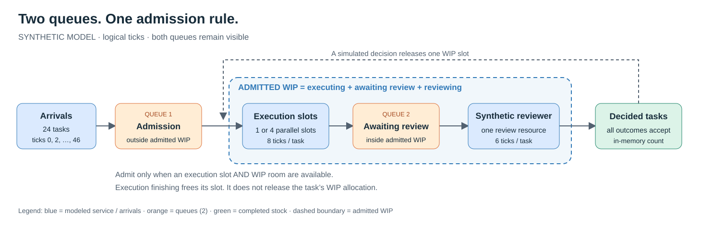
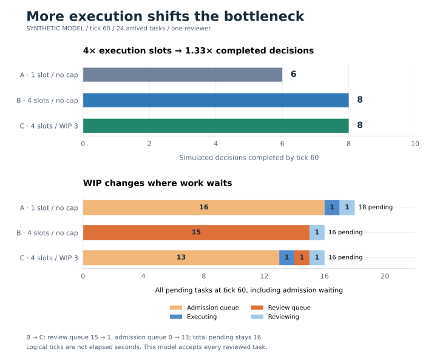
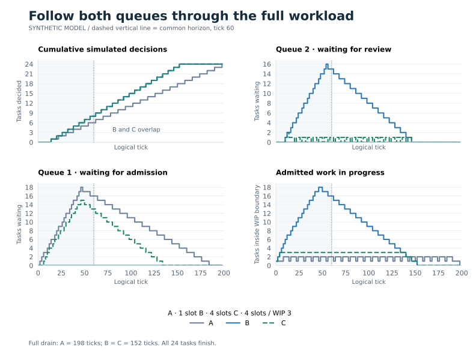
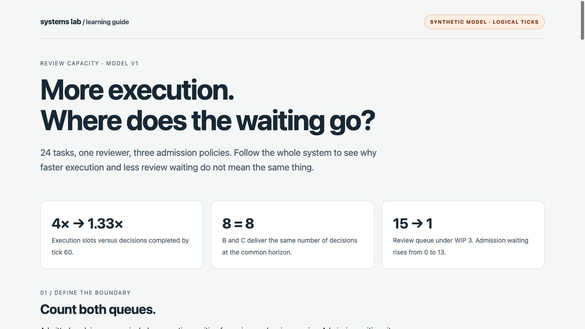

# Review capacity: where does the waiting go?

**Four execution slots complete 8 decisions by tick 60, versus 6 with one slot.
WIP 3 keeps those 8 decisions, but moves most waiting from review to admission.**
These are results of the supplied deterministic model, not measurements of agents
or a real team's productivity.

[Open the interactive learning guide](../../docs/graphics/review-capacity/explainer.html)
in a browser from a local checkout. It contains policy selection, a logical-time
slider and task replay. GitHub displays HTML as source; the figures below remain
readable there. This frozen learning artifact is separate from the pending
integrated Experiments dashboard.

## Start with the boundary



There are **two in-memory queues**. Admission requires a free execution slot and
room under the WIP cap. Admitted WIP includes executing, awaiting-review and
reviewing tasks. Admission waiting remains outside that cap, but inside the
measurement boundary. Finishing execution frees an execution slot; only a
simulated decision frees the task's WIP allocation.

The synthetic reviewer is one modeled resource, separate from the playground's
Reviewer agent. Execution ticks represent abstract automated service; they do
not time the Researcher, Builder or Reviewer implementations.

## Question, prediction and controlled comparison

**Question:** when execution speeds up but review stays fixed, how much more
accepted output leaves the system, and where does unfinished work accumulate?

**Prediction:** increasing execution slots will increase review waiting without
multiplying accepted output fourfold. A WIP cap may keep the reviewer supplied
while reducing admitted work and moving waiting upstream.

The checked-in [scenario](scenario.json) holds these inputs fixed:

| Input | Value |
| --- | --- |
| Workload | 24 tasks, arriving at ticks 0, 2, …, 46 |
| Execution demand | 8 ticks per task |
| Review service | 6 ticks, one reviewer, every decision accepts |
| Scheduling | FIFO admission; review ordered by ready tick and task ID |
| Common observation | Tick 60, including transitions at that tick |
| Drain bound | Tick 500; actual final decision recorded separately |
| Model version | `review-capacity-v1` |

| Policy | Execution slots | Total admitted WIP cap |
| --- | ---: | ---: |
| A · baseline | 1 | None |
| B · more execution | 4 | None |
| C · bounded WIP | 4 | 3 |

**A → B changes execution slots. B → C changes only the admission cap.**
Ticks are logical model time, not seconds. At a shared tick, services complete,
arrivals register, review starts and eligible tasks enter execution before the
post-transition state is recorded.

## Read delivery and unfinished work together



| At tick 60 | A | B | C |
| --- | ---: | ---: | ---: |
| Simulated decisions completed | 6 | 8 | 8 |
| Total unfinished tasks | 18 | 16 | 16 |
| Waiting for admission | 16 | 0 | 13 |
| Executing | 1 | 0 | 1 |
| Waiting for review | 0 | 15 | 1 |
| Being reviewed | 1 | 1 | 1 |
| Admitted WIP | 2 | 16 | 3 |
| Not yet arrived | 0 | 0 | 0 |

Read the comparison in two passes:

1. **A → B:** 4× execution capacity produces 8/6 = **1.33× completed decisions**
   over the same window. Execution helps; fixed review service constrains
   further output. This ratio includes startup and finite-horizon effects;
   it is not a universal scaling law.
2. **B → C:** the review queue falls from **15 to 1**, while admission waiting
   rises from **0 to 13**. Total unfinished work remains **16**. The cap changes
   where tasks wait; it does not remove demand or create review capacity.

Conservation is visible without reading code:
`24 = admission queue + executing + review queue + reviewing + decided`.
At earlier ticks, also count tasks scheduled to arrive in the future.

## Follow the complete workload



The dotted vertical line marks the common horizon. Curves continue through full
drain; step values hold between events. **B and C have identical per-task decision
ticks** here, despite markedly different queue occupancy.

| Full drain · the same 24 tasks | A | B | C |
| --- | ---: | ---: | ---: |
| Final decision / makespan, ticks | 198 | 152 | 152 |
| End-to-end time p50 / p95, ticks | 80 / 146 | 58 / 102 | 58 / 102 |
| Admission wait p50 / p95, ticks | 66 / 132 | 0 / 0 | 40 / 84 |
| Review-queue wait p50 / p95, ticks | 0 / 0 | 44 / 88 | 4 / 4 |

This supports the selected prediction: C keeps the reviewer supplied while
limiting admitted work. It exposes the tradeoff: **the same delivery timing can
coexist with a smaller review queue and more upstream waiting**. WIP 3 is
sufficient here; the experiment does not establish an optimal cap for other
workloads or measure cost, context switching or quality improvements.

## Read the metrics without losing the denominator

- Horizon counts use decisions at or before tick 60. Pending means **all 24
  scheduled tasks minus those decisions**, including future arrivals when any
  remain. `not_arrived` identifies that portion separately.
- Horizon latency and wait percentiles include only tasks decided in that
  window: A has **n = 6**, B and C **n = 8**. These are selected completed
  cohorts, not the whole workload or automatically identical task sets.
- Full-drain percentiles above use the same **n = 24** tasks per policy.
  If the drain bound is exhausted, the report marks it incomplete and makespan
  unavailable; pending work is retained.
- p50/p95 use nearest rank: sort values and select rank `ceil(p × n)`.
  Zero completed observations produce `null`, not zero waiting.
- Queue means and utilization integrate post-transition occupancy over logical
  time. An unweighted average of event snapshots would bias the result.
  Execution utilization is normalized by execution slots.
- Admission wait is admission minus arrival; review wait excludes review
  service. End-to-end time includes both waits and both services. **Do not add
  component percentiles as a general rule**: a sum of medians is not generally
  the median of the sum.

## Inspect tasks one tick at a time



In the [interactive guide](../../docs/graphics/review-capacity/explainer.html),
the **saved trace** module lets you inspect the same evidence at task level:

1. Select **A, B or C** to switch policy without changing the workload.
2. Use **Start**, **Horizon** and **Full drain**, or seek with the logical-tick
   slider. Each tile shows where one task is at that tick.
3. Read the two queues alongside occupied execution slots, the single synthetic
   reviewer and decided tasks. The footer reconciles WIP, future arrivals and
   total unfinished work.
4. Use **Play / Pause** and playback speed to follow the saved transitions.
   Playback speed changes viewing time, not the model or its results.

This page has embedded data and figures, so its replay also works offline.
It does not invoke workers, run a new experiment or operate permissions.

## Connect the result to systems thinking

Queues are stocks; arrivals, admission, execution completion and review are
flows. Review is a capacity constraint for B and C after startup. The cap is
a balancing admission rule: occupied WIP blocks intake until a decision frees
room.

The measurement boundary changes the apparent result. Observe only awaiting
review and C looks much faster. Include admission waiting and end-to-end
decisions, and the location of waiting becomes the central observation. This
is our interpretation of a teaching model, not a quoted result or experiment
from *Thinking in Systems*.

## Reproduce and inspect the evidence

From the repository root:

```sh
uv run --locked systems-lab experiment review-capacity \
  --scenario experiments/review-capacity/scenario.json
```

The printed manifest identifies a new directory under
`.lab/experiments/review-capacity/`, with `scenario.json`, `report.json` and the
completion marker `manifest.json`. The command generates no control credentials
and invokes no agent workers, providers, approval or canonical audit journal.
The proposed `make review-capacity-demo` target is not implemented yet.

Repeating an input creates a fresh attempt with identical report bytes and hash;
an explicit reused `--attempt-id` is rejected. `status: complete` describes the
artifact files, independently of numerical `drain.complete`.

The graphics were regenerated from a CLI export on **5 October 2026**. Their
[frozen documentation projection](../../docs/graphics/review-capacity/evidence.json)
contains teaching traces and metrics without runtime event or attempt IDs.
Original attempts stay in ignored `.lab/`. These are **not dashboard screenshots,
operational history or OpenTelemetry measurements**.

| Reference | SHA-256 |
| --- | --- |
| Scenario | `77c8a82e574cf23eb7bd1babd76332daa1a04926309f34427f638d1f29d3fae3` |
| Deterministic report | `a3a9c0396620438fa7c039f5aa9aace98a85cff968ba5004c52e5e25f473e58a` |

Hashes detect disagreement against a preserved reference. A privileged owner
can rewrite both a local file and its hash; these files are not WORM storage.
An independently retained reference is needed for a stronger history claim.

## Try to disprove the explanation

1. Change only C's `wip_limit` from 3 to 2. Does review become starved, and does
   full-drain time increase? Inspect utilization and both queues.
2. Change `review_ticks` from 6 to 3 for all policies, keeping the rest fixed.
   Does the limiting stage move toward execution? Compare the common horizon
   and complete cohort separately.
3. Before transferring this idea to actual agents, specify rework, failures,
   quality and permission-release semantics. That is a separate runtime
   experiment; the current numerical model cannot validate them.

## Limits and current delivery status

Every review accepts. Arrivals are finite and scheduled; service is uniform.
There is no stochasticity, priority, output quality, rework, fatigue, failure,
real human approval or empirical relationship to a team's throughput.

The numerical model, exclusive export and CLI are implemented. Their two test
files pass **50 tests**. The publication package also passes `make check`:
Ruff lint/format, **83 tests passed**, **5 container tests skipped** by default,
and Compose configuration validation. `make spec-check` passes all four items.
The learning guide was inspected at desktop and mobile sizes.

The integrated Experiments API, dashboard replay, Make demo target and complete
v0.2 acceptance remain pending. The model's observation-horizon maximum is
currently 50000, while the design selects 10000; alignment remains an open task.
The standalone learning guide is documentation, not completion of those product
features. The unfinished API test draft is preserved in the implementation
checkout and is excluded from this publication package.
